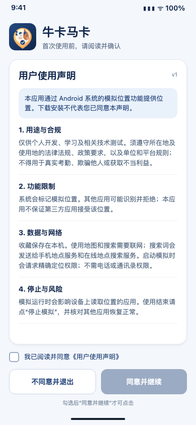
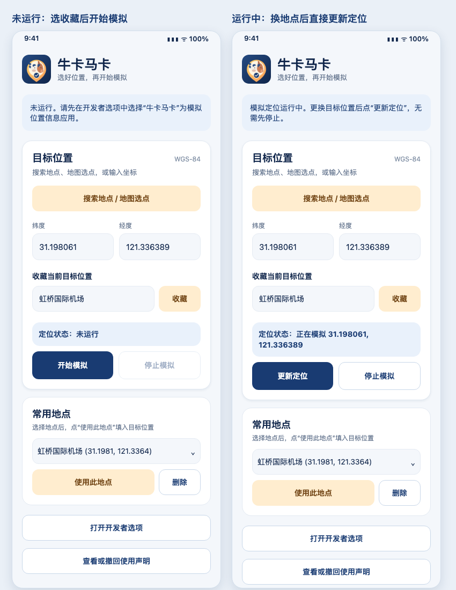
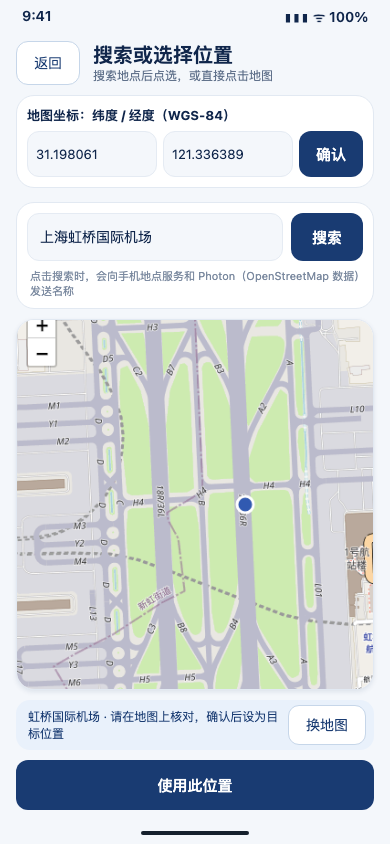

# 牛卡马卡

适用于 **Android 8.0 及以上**的模拟定位工具，仅供个人开发、学习及与此直接相关的技术测试。支持输入 WGS-84 经纬度、搜索中文或英文地点、在地图上选点，以及收藏常用地点。本仓库仅提供 APK、使用说明和界面示意图，**不包含应用源码**。

**[下载牛卡马卡 APK](./牛卡马卡-Android8+.apk)** · 版本：1.6.1 · 开发测试签名

## 界面展示

首次打开应用时须阅读《用户使用声明》，主动勾选同意后才能继续；不同意可退出。之后可从首页重新查看或撤回。

首页区分“未运行”和“正在模拟”。常用地点可直接填回目标位置；运行中更换地点后可点“更新定位”，无需先停止。

搜索结果点选后，地图跳转并放大到该地点，顶部显示可核对、可修改的经纬度。

以上为根据应用界面制作的示意图，示例地点为**虹桥国际机场**；实际地图和搜索结果以手机上显示的内容为准。

## 安装与首次设置

1. 下载并安装上方 APK。已安装同一签名的旧版时可直接升级；如签名不同，可能需要先卸载旧版。升级会保留本机收藏地点。
2. 在手机设置中开启“开发者选项”，找到“选择模拟位置信息应用”，选择“牛卡马卡”。三星手机的菜单名称和路径可能因系统版本而异。
3. 打开应用，阅读声明并勾选同意。首次启动模拟定位时按系统提示授予**精确定位**权限，并确保系统定位服务已开启。

## 选择与使用位置

1. 在首页“目标位置”输入 WGS-84 纬度、经度，或点“搜索地点 / 地图选点”。
2. 搜索中文或英文地点后点选结果，在地图上核对标记和顶部坐标。也可以直接点地图选位置，或修改顶部坐标。
3. 点地图页顶部“确认”或底部“使用此位置”，将坐标带回首页。此时尚未开始模拟。
4. 点击“开始模拟”。首页状态区和通知会显示正在模拟的坐标。更换目标位置后点“更新定位”即可切换；只有需要结束模拟时才点“停止模拟”。

收藏地点时，在“目标位置”卡片中填写名称（可留空），点“收藏”。以后在“常用地点”选择该地点，点“使用此地点”填回目标位置，再点“开始模拟”或“更新定位”使其生效。收藏只保存在本机。

## 用户使用声明与免责声明

**用途与规则。**本应用仅供个人开发、学习及与此直接相关的技术测试。使用时必须遵守所在地及使用地的法律法规、政策要求，以及单位和平台规则；不得用于真实考勤、欺骗他人、获取不当利益或其他实际业务用途。

**模拟位置与风险。**Android 会将本应用提供的位置标记为模拟位置。其他应用可以识别并拒绝，本应用不保证任何第三方应用接受该位置，也不提供绕过检测的功能。请自行核对坐标；模拟运行时可能影响本设备上其他应用读取的位置。使用结束后应停止模拟，并核对设备位置是否恢复正常。百度地图或高德地图显示的坐标可能不是 WGS-84，请在本应用地图上再次核对。

**权限、数据与网络。**应用使用定位、网络和前台服务相关权限；不要求电话、通讯录或文件访问权限，也不读取设备的真实位置。收藏地点和同意记录仅保存在本机。地图数据来自 OpenFreeMap，备用地图使用 OpenStreetMap 瓦片；地图服务可能获知浏览区域和网络地址。只有点击搜索时，地点名称才会发送给手机的地理编码服务和第三方在线地点搜索服务。后者基于 OpenStreetMap 数据，请求域名为 `photon.komoot.io`。搜索结果需要用户核对，不保证所有地点都能找到；没有搜索服务时仍可地图选点或手动输入坐标。

**同意与撤回。**下载安装不代表同意。首次打开应用时，须阅读声明并主动勾选“我已阅读并同意《用户使用声明》”后才能使用；不同意可退出。之后可在首页查看或撤回同意。撤回会停止模拟并退出，再次使用须重新同意。使用者对自己的使用行为依法承担责任；发布者依法应承担的责任不因本声明而被排除。

维护者：[lyhgalaxy](https://github.com/lyhgalaxy)。问题与反馈请使用 [GitHub Issues](https://github.com/lyhgalaxy/NiumaClockIn/issues)；请勿在公开 Issue 中提交个人敏感信息。

APK SHA-256：`dd058b944f734eeecdb8ae733c851f6799a14d9a47ba9a7b984eeb952b6ea670`
